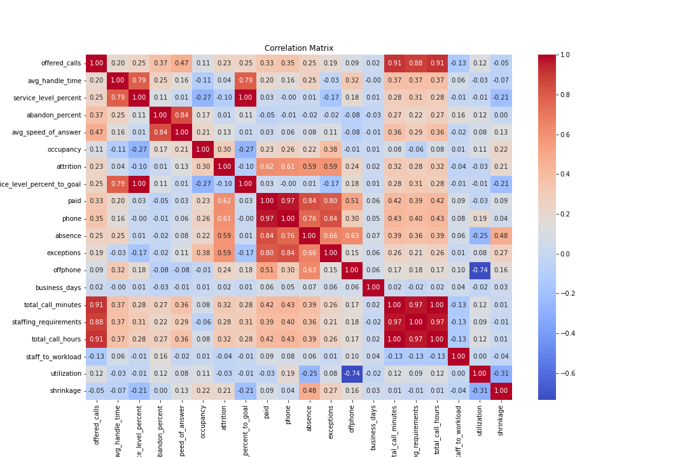
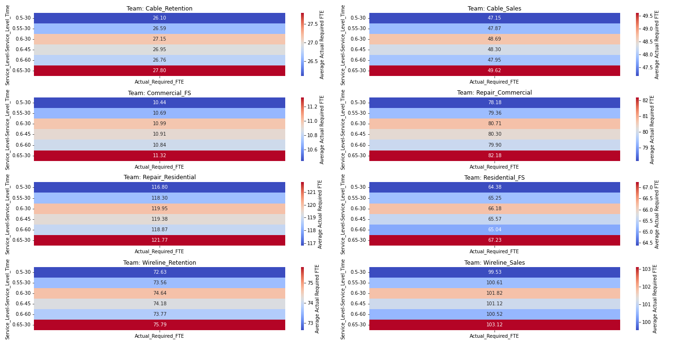
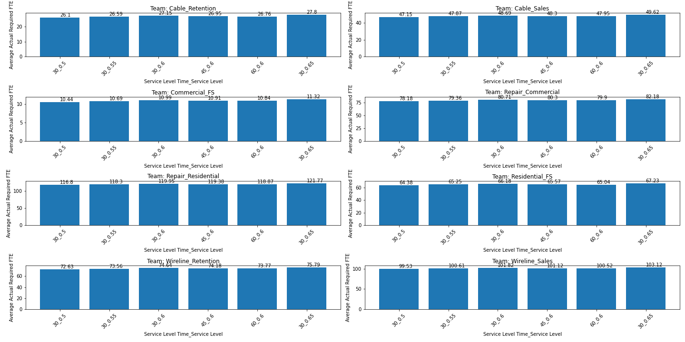

# Service Level Sensitivity
## Overview:

This Service Level Sensitivity Analysis applies various machine learning models to determine the sensitivity and interconnectedness of various service level metrics, providing deep insights into call center operations. This project aims to highlight and understand how changes in your Service Level Agreement (SLA) can significantly affect your overall staffing requirements.

## Problem:

Lowering SLAs generally lowers the staffing requirements for meeting SLAs, but what impacts are created in other variables that may or may not actually drive lower staffing requirements. For instance, lower service levels impact other call center metrics, such as increased average handle time (primarily wrap), increased occupancy, and increased shrinkage. All of those metrics are generally drivers of increased staffing. 

This analysis attempts to answer the following questions:

1. What is the relationship between service level and other call center metrics?
2. How much will staffing requirements decrease at different SLA targets?
3. Does lowering SLAs generate actual cost savings from a headcount perspective?

## Call Center Metric Relationships

Several different models were employed to explore the relationships between the different call center metrics and predict staffing requirements. Models developed were standard linear regression, multivariate regression, gradient boosting regression, and random forest regression, which is an ensemble method that combines multiple decision trees to make predictions. The Random Forest Regression had the greatest predictive capabilities with the highest level of accuracy and was used for the final models.

The models were initially trained on just the sales group to test the predictive capabilities of the model, but the correlations in both the smaller training set and overall model remained fairly consistent. Here is the correlation matrix for the combined dataset. 

Interesting findings in the correlations matrix were that abandonment percentage and average speed of answer (ASA) had moderate negative correlation with staffing requirements, suggesting that as staffing goes up abandonment and ASA go down. This is definitely the case with service level, but it's interesting the model picked up a separate relationship with staffing requirements as well. Additionally, due to occupancy being more of an agent metric than a queue metric, the model did not pick up on strong correlation between occupancy and staffing requirements. Differing call priorities and multiskilling likely further complicated the relationship within the models. As expected, offered calls, average handle time, and the derivative workload calculations had strong positive correlations with staffing requirements. 

## Erlang C Calculations

After establishing relationships, the dataset was run through Erlang C calculations at different SLA variations. The model then compared staffing results on the same data at the following SLAs:

- 65% in 30 seconds (current baseline)
- 60% in 30 seconds
- 55% in 30 seconds
- 50% in 30 seconds
- 60% in 45 seconds
- 60% in 60 seconds

The dataset for the model included the last 15 months of call data for every 30-minute interval. Staffing requirements were run for each interval, rolled up to a daily aggregation, and then averaged across the dataset as a whole to get a representative sample of impacts. The following heatmap shows the results of the Erlang differences for each team at different SLAs:

The same information is here represented in bar graph form:

## Regression Factors on Erlang Outputs

The Erlang models represent how staffing requirements change at different SLAs if all things remain constant. The complex relationship between variables in the regressions and machine learning models indicates those variables will not remain constant, however. 

