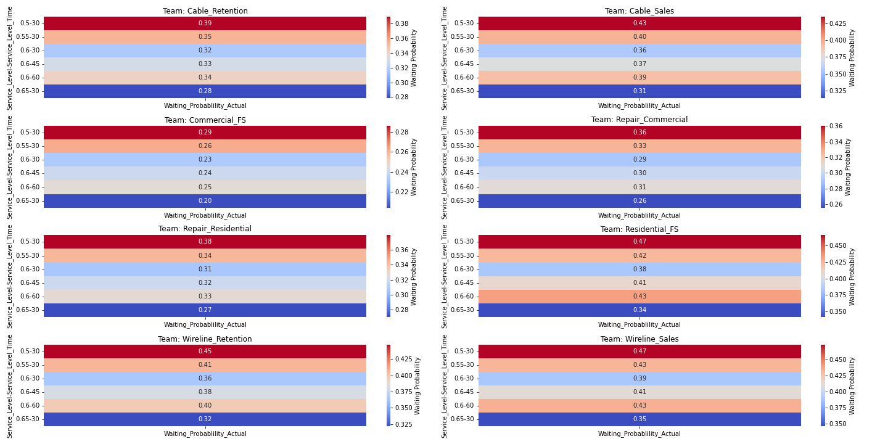
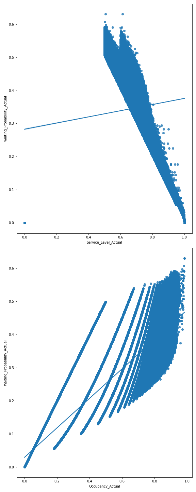

# Service Level Sensitivity
## Overview:

This Service Level Sensitivity Analysis applies various machine learning models to determine the sensitivity and interconnectedness of various service level metrics, providing deep insights into call center operations. This project aims to highlight and understand how changes in your Service Level Agreement (SLA) can significantly affect your overall staffing requirements.

## Problem:

Lowering SLAs generally lowers the staffing requirements for meeting SLAs, but what impacts are created in other variables that may or may not actually drive lower staffing requirements. For instance, lower service levels impact other call center metrics, such as increased average handle time (primarily wrap), increased occupancy, and increased shrinkage. All of those metrics are generally drivers of increased staffing. 

This analysis attempts to answer the following questions:

1. What is the relationship between service level and other call center metrics?
2. How much will staffing requirements decrease at different SLA targets?
3. Does lowering SLAs generate actual cost savings from a headcount perspective?

## Call Center Metric Relationships

Several different models were employed to explore the relationships between the different call center metrics and predict staffing requirements. Models developed were standard linear regression, multivariate regression, gradient boosting regression, and random forest regression, which is an ensemble method that combines multiple decision trees to make predictions. The Random Forest Regression had the greatest predictive capabilities with the highest level of accuracy and was used for the final models.

The models were initially trained on just the sales group to test the predictive capabilities of the model, but the correlations in both the smaller training set and overall model remained fairly consistent. Here is the correlation matrix for the combined dataset. 

Interesting findings in the correlations matrix were that abandonment percentage and average speed of answer (ASA) had moderate negative correlation with staffing requirements, suggesting that as staffing goes up abandonment and ASA go down. This is definitely the case with service level, but it's interesting the model picked up a separate relationship with staffing requirements as well. Additionally, due to occupancy being more of an agent metric than a queue metric, the model did not pick up on strong correlation between occupancy and staffing requirements. Differing call priorities and multiskilling likely further complicated the relationship within the models. As expected, offered calls, average handle time, and the derivative workload calculations had strong positive correlations with staffing requirements. 

## Erlang C Calculations

After establishing relationships, the dataset was run through Erlang C calculations at different SLA variations. The model then compared staffing results on the same data at the following SLAs:

- 65% in 30 seconds (current baseline)
- 60% in 30 seconds
- 55% in 30 seconds
- 50% in 30 seconds
- 60% in 45 seconds
- 60% in 60 seconds

The dataset for the model included the last 15 months of call data for every 30-minute interval. Staffing requirements were run for each interval, rolled up to a daily aggregation, and then averaged across the dataset as a whole to get a representative sample of impacts. The following heatmap shows the results of the Erlang differences for each team at different SLAs:

The same information is here represented in bar graph form:

## Regression Factors on Erlang Outputs

The Erlang models represent how staffing requirements change at different SLAs if all things remain constant. The complex relationship between variables in the regressions and machine learning models indicates those variables will not remain constant, however. The probability a call waits is an important variable to determine how some of the other relationships may change as we alter SLAs. Here is a heatmap of the waiting probability at the different SLA targets:

As the probability a call waits increases, so too does the abandonment percentage increase. Also, as we consider the probability a calls waits, we must also consider that as the same probability an agent has back-to-back calls, which typically also increases average handle time (primarily wrap) and occupancy. In other words, as the probability a call waits increases, it is also proportionately more likely that staffing requirements increase because the workload actually increases as a result of higher occupancy. Here are separate regressions for waiting probability vs service level and occupancy for reference:

In terms of basic workload calculations, for every 100 calls and 30 seconds of handle time, the staffing requirements increase by 0.83. This does not factor in additional variables such as shrinkage or occupancy targets, which would further increase that number. Thus, for larger teams who take thousands of calls per day, increases to handle time quickly increase staffing requirements. Those increases likely exceed any FTE savings generated by lowering SLAs.

## Conclusions 

The relationships between call center metrics is highly complex and difficult to model. Thus, it is extremely difficult to quantitively state that a 5% change to SLA equals an n% change to handle time or other correlative metrics. The only directly quantifiable metrics from changing service level are staffing requirements, occupancy, and waiting probability. From those metrics, though, we are able to infer impacts on other metrics and discuss them probabilistically. 

Staffing requirements do decrease as SLAs are lowered; however, the probability a call waits increases. Waiting probability positively correlates with occupancy, so that increasing waiting probability will also increase occupancy. In the scope of this model, it was not possible to directly correlate occupancy with other metrics because it is an agent metric with various non-metric complexities; however, occupancy increases generally do lead to increases in other agent-based metrics, such as handle time and shrinkage. Further, high occupancy is generally assumed to lead to agent burnout and higher attrition. Given those assumptions, increasing the probability a call waits will likely also increase the more agent-based metrics of handle time, shrinkage, and attrition. Of those metrics, handle time and shrinkage directly increase staffing requirements. 

In conclusion, lowering SLAs would reduce staffing requirements by a few headcount (on average) per team, but the commensurate increases to call wait times, handle times, and shrinkage would very likely offset any headcount reductions from lowering SLAs. Accordingly, there is not a tangible cost savings associated with lowering SLAs, and it is not recommended as a strictly cost-saving measure. 

## Recommendations for Further Analysis

- Based on this analysis, further analysis is recommended to determine what the "right" SLAs would be for each team and/or service. Given more time and data, customer behaviors could be correlated with agent and call metrics to determine the "sweet spot" for SLAs, and right-size the metric per team and service. 
- If LLMs could be applied to call recordings, customer sentiment could also be correlated with wait times with strong predictive capabilities for right-sizing the SLA metric. 
- Neural network machine learning models could be applied to the dataset to help better model the highly complex relationship between staffing, agent, and calls metrics. A more advanced model would be more likely to pick up on the more interconnected correlations.
